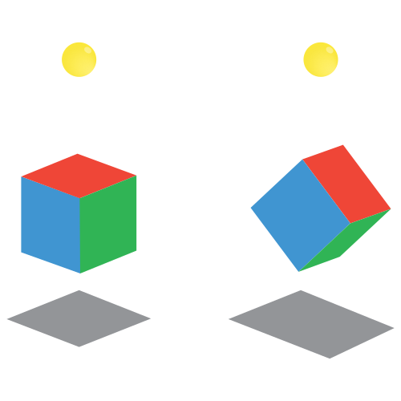

# Cubic UFO
## Problem
A mysterious cubic alien ship has appeared in the sky over Toronto! In this
problem, Toronto is a plane in three-dimensional space that is parallel to the
xz plane at y = -3 km. The alien ship is a solid cube with side length 1 km,
centered at (0 km, 0 km, 0 km), with its eight corners at (+/- 0.5 km, +/- 0.5
km, +/- 0.5 km). The ship is casting an ominous shadow onto the plane;
formally, the shadow is the orthogonal projection of the cube onto the plane.
(We consider the sun to be a point infinitely far above the Toronto plane along
the y-axis.)

The military is willing to tolerate the ship as long as the aliens meet their
bureaucratic demand: the shadow must cover an area of the plane that is
acceptably close to **A** km² (see the Output section for a precise
definition). They have hired you, a geometric linguistics expert, to convey
this demand to the aliens. In your communications so far, you have learned that
the ship cannot change size, and the center of the ship cannot move, but the
ship is able to rotate arbitrarily in place.

Please find a way that the aliens can rotate the ship so that the shadow's area
is close to **A**. Express your rotation using three points: the centers of any
three non-pairwise-opposing faces.

## Input
The first line of the input gives the number of test cases, **T**. **T** test
cases follow; each consists of one line with a rational **A**, the desired area
of the shadow, in km², with exactly six digits after the decimal point.

It is guaranteed that there is always a way to rotate the ship in the desired
manner for the values of **A** allowed in this problem.

## Output
For each test case, first output one line containing `Case #x:`, where `x` is
the test case number (starting from 1). Then, output three more lines with
three rational values each: the `x`, `y`, and `z` coordinates of one of your
three provided face-centers, as described above. You are welcome to use decimal
(e.g., `0.000123456`) or scientific notation (e.g., `1.23456e-4`).

Your answer will be considered correct if and only if all of the following are
true:

1. The distance (in km) from each point to the origin must be between `0.5 -
   10⁻⁶` and `0.5 + 10⁻⁶`, inclusive.
2. The angles (in radians) between segments connecting the origin to each point
   must be between `π/2 - 10⁻⁶` and `π/2 + 10⁻⁶`, inclusive.
3. The area of the shadow (in km²), computed by projecting all 8 vertices onto
   the `y = -3` plane and finding the area of the convex hull of those
   projected points, must be between `A - 10⁻⁶` and `A + 10⁻⁶`, inclusive. We
   will compute the vertices as `+/- p1 +/- p2 +/- p3` (that is, for each pi we
   add either `pi` or `-pi` to the total using vector addition), where p1, p2,
   and p3 are the face-centers that you provide.

Please note that you might need to output more than 6 digits after the decimal
point to safely pass the checks mentioned above. If there are multiple
acceptable answers, you may output any one of them.

## Limits
1 ≤ **T** ≤ 100.
Time limit: 30 seconds per test set.
Memory limit: 1GB.

## Test set 1 (Visible)
1.000000 ≤ **A** ≤ 1.414213

## Test set 2 (Hidden)
1.000000 ≤ **A** ≤ 1.732050

## Sample
### Input
```
2
1.000000
1.414213
```

### Output
```
Case #1:
0.5 0 0
0 0.5 0
0 0 0.5
Case #2:
0.3535533905932738 0.3535533905932738 0
-0.3535533905932738 0.3535533905932738 0
0 0 0.5
```

In Sample Case #1, there is no need to rotate the cube at all; with two of its
faces already parallel to the plane, the cube is already casting a shadow that
is a square with side length 1.

In Sample Case #2, one possible solution is to tell the aliens to give the cube
a 45 degree turn around the x = y = 0 line, creating a shadow that is a
rectangle with dimensions of 1 and sqrt(2).

The following rough image shows the cubes and shadows for Sample Cases #1
and #2. The sun is shown for clarity, but remember that it is actually a point
infinitely far away along the y-axis.


